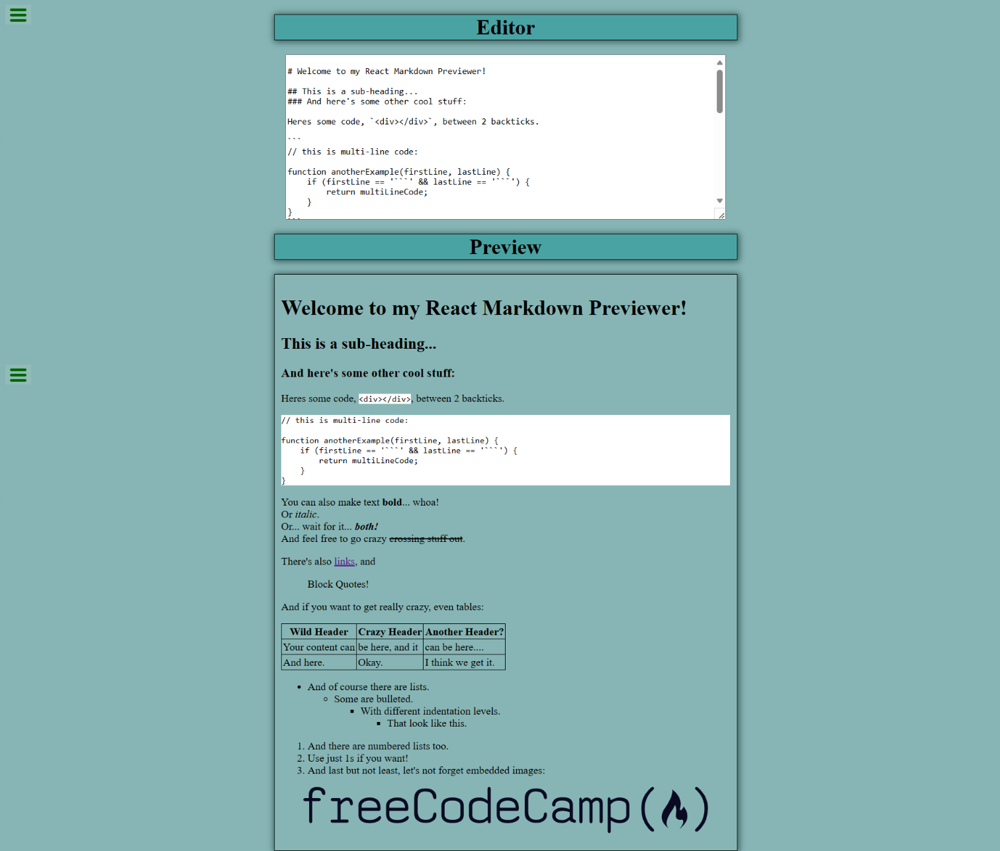

# Markdown Previewer using React

## Table of Contents

- [About](#about)
  - [Built With](#built-with)

## About

This project focuses on building a markdown using React. The editor accepts GitHub flavored markdown and converts it into HTML that is then displayed on the previewer.

SCSS/SASS was used to styles the website.

### Built With

- HTML
- CSS
- React
- SASS/SCSS